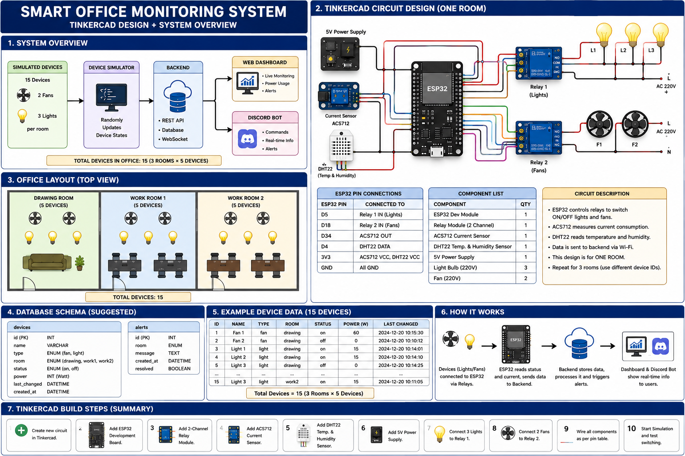
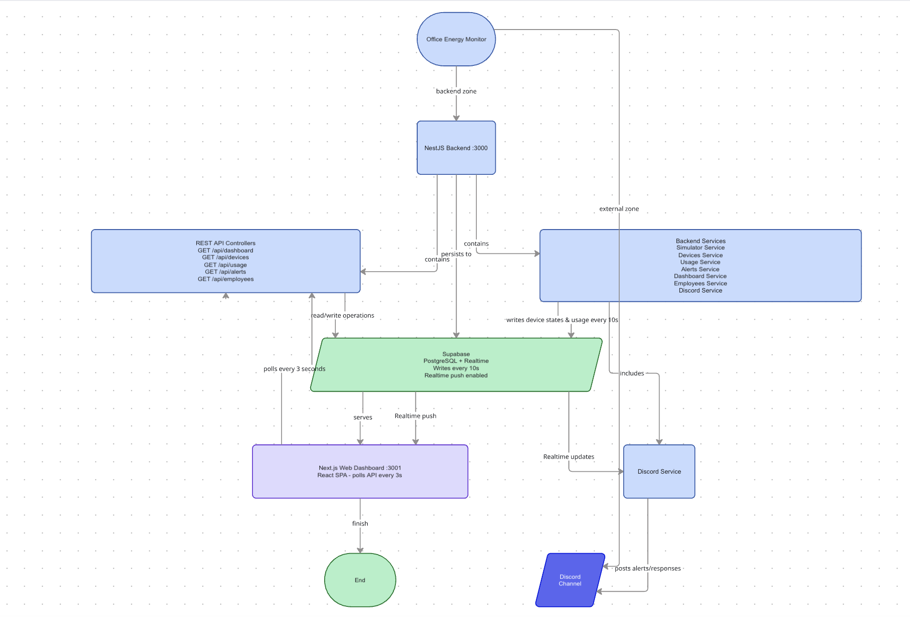
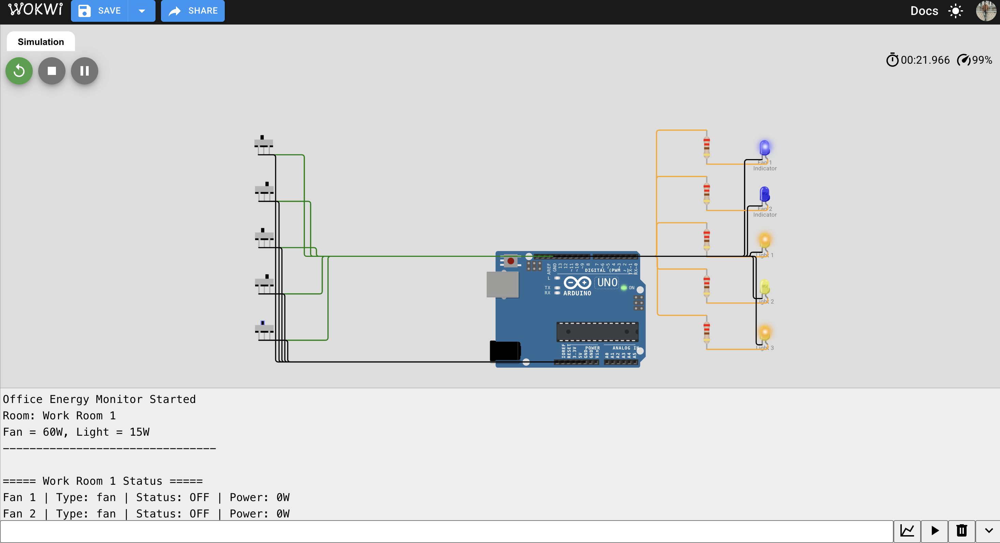

# Office Energy Monitor

Full-stack office energy monitoring system with a NestJS backend (REST API + Discord bot) and a Next.js dashboard. Simulates 15 devices (fans + lights) across 3 rooms, tracks power usage, and detects anomalies.



---

## Quick Start

```bash
# 1. Backend setup
cd backend
cp .env.example .env        # edit with your keys
npm install
npm run start:dev            # starts API on :3000

# 2. Dashboard (in another terminal)
cd office-energy-monitor
npm install
npm run dev                  # starts on :3001
```

The backend auto-seeds rooms, devices, and employees on first run. The simulator starts toggling devices every 10 seconds.

---

## Prerequisites

- Node.js 18+
- A Supabase project (free tier) — [supabase.com](https://supabase.com)
- (Optional) Discord bot token + server for bot features

---

## Setup — Step by Step

### 1. Supabase

Create a project at [supabase.com](https://supabase.com). Go to **SQL Editor**, paste and run the schema:

```
backend/docs/supabase-schema.sql
```

Go to **Project Settings → API** and copy your `Project URL` and `anon public key`. Enable Realtime replication for `devices`, `alerts`, and `usage_logs` tables (the schema handles this automatically).

### 2. Backend (`backend/`)

```bash
cd backend
cp .env.example .env
npm install
```

Fill `.env` with your Supabase credentials:

```env
SUPABASE_URL=https://your-project.supabase.co
SUPABASE_ANON_KEY=your-anon-key
DISCORD_BOT_TOKEN=                 # leave empty to skip bot
DISCORD_ALERT_CHANNEL_ID=          # leave empty
GROQ_API_KEY=                      # leave empty
PORT=3000
```

**Run:**

```bash
npm run start:dev      # development (watch mode)
# or
npm run build && npm run start:prod  # production
```

On first start, the backend automatically seeds:
- 3 rooms (Drawing Room, Work Room 1, Work Room 2)
- 15 devices (2 fans + 3 lights per room, all OFF)
- 2 employees

The simulator then begins randomly toggling 1–3 devices every 10 seconds and logging per-room power usage.

### 3. Discord Bot (optional)

1. Go to [Discord Developer Portal](https://discord.com/developers/applications)
2. Create a **New Application** → **Bot** tab → **Add Bot**
3. Enable **Message Content Intent** and **Server Members Intent**
4. Copy the bot token into `.env`: `DISCORD_BOT_TOKEN=your-token`
5. **OAuth2 → URL Generator**: scope `bot`, permissions `Send Messages`, `Read Messages`, `Read Message History`
6. Use the generated URL to invite the bot to your server
7. Right-click the target channel → **Copy Channel ID** → set `DISCORD_ALERT_CHANNEL_ID` in `.env`

(Optional) Set `GROQ_API_KEY` for LLM-powered conversational responses. Without it, the bot uses templated fallbacks.

### 4. Dashboard (`office-energy-monitor/`)

```bash
cd office-energy-monitor
npm install
```

A `.env.local` is already configured:

```env
NEXT_PUBLIC_API_URL=http://localhost:3000
```

**Run:**

```bash
npm run dev
```

Opens at [http://localhost:3001](http://localhost:3001). Polls the backend every 3 seconds for live updates.

---

## API Endpoints

| Method | Path | Description |
|--------|------|-------------|
| `GET` | `/api/devices` | All devices with room info |
| `GET` | `/api/devices/room/:roomName` | Devices by room (`drawing`, `work1`, `work2`) |
| `GET` | `/api/usage` | Total + per-room power breakdown |
| `GET` | `/api/usage/history?hours=24` | Historical usage logs |
| `GET` | `/api/alerts` | Active alerts |
| `GET` | `/api/employees` | Employee list |

## Discord Bot Commands

| Command | Description |
|---------|-------------|
| `!status` | On/off status for all 3 rooms |
| `!room <name>` | Status of a specific room |
| `!usage` | Current power consumption + daily kWh estimate |

The bot proactively posts alerts to the configured channel when devices are on after hours (9 AM–5 PM) or running for >2 hours continuously.

---

## Dashboard Features

| Section | Description |
|---------|-------------|
| **Summary Cards** | Total power, devices ON/OFF, active alerts |
| **Office Layout** | Visual room view with spinning fans and glowing lights |
| **Live Device Status** | All devices per room with ON/OFF badges |
| **Power Meter** | Current wattage, per-room breakdown, daily kWh |
| **Active Alerts** | After-hours and continuous-on warnings |

System Diagram:


Cuircit Diagram:


---

## How It Works

| Component | What it does | Interval |
|-----------|-------------|----------|
| **Simulator Service** | Randomly toggles 1–3 devices ON/OFF | Every 10s |
| **Alert Service** | Checks for after-hours / continuous-on devices | Every 60s |
| **Usage Logger** | Calculates per-room wattage and logs to Supabase | Every 10s |
| **Dashboard** | Polls API for live device data | Every 3s |
| **Discord Bot** | Responds to commands + pushes alerts | Real-time (Realtime) |

**Devices:** 2 fans (60W each) + 3 lights (15W each) per room × 3 rooms = 15 devices.
