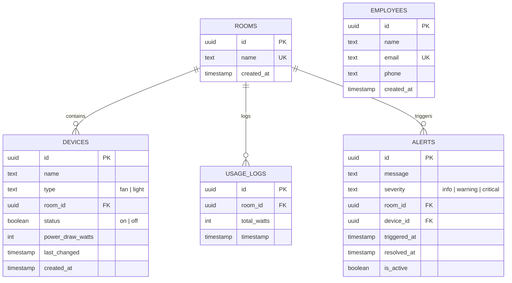
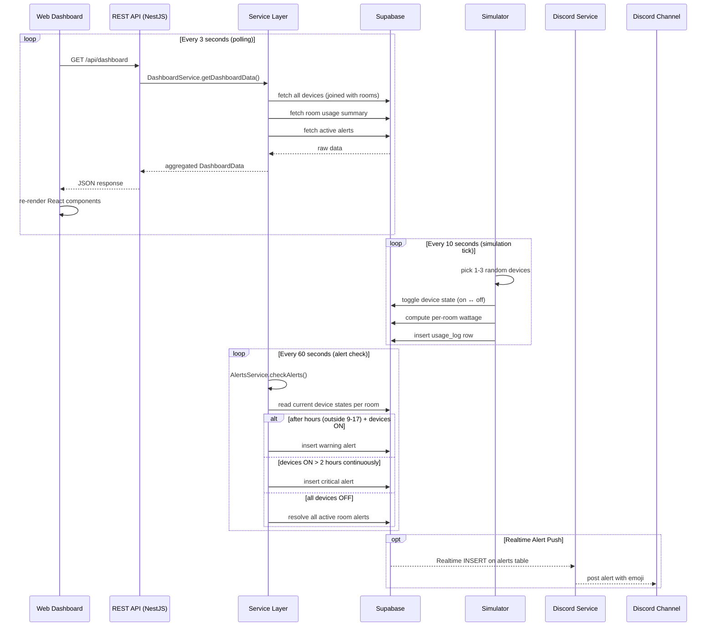
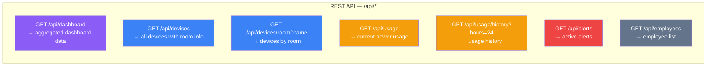
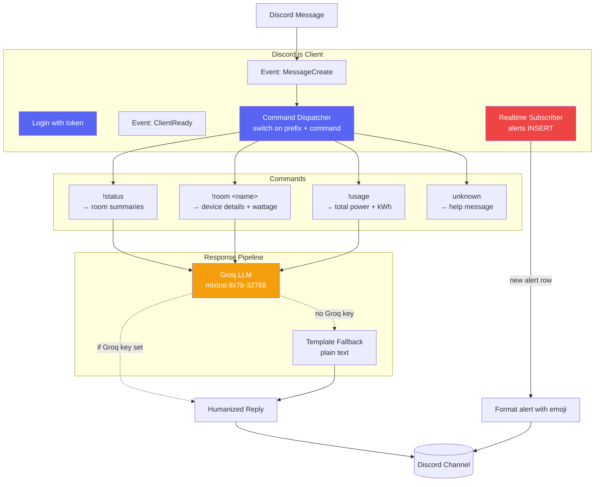
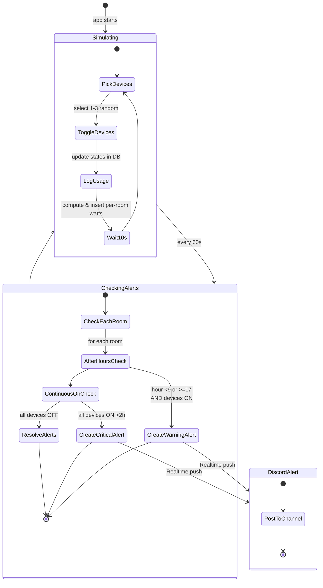
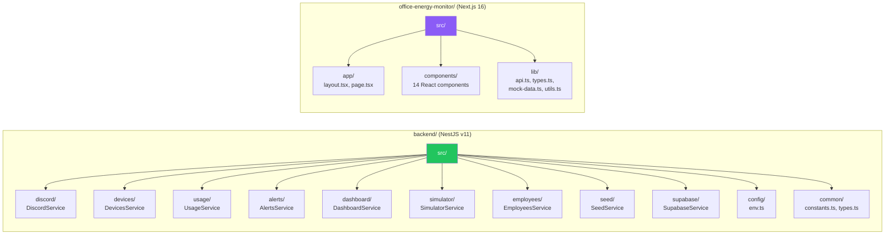

# Office Energy Monitor — System Diagrams

---

## 1. System Architecture Overview

```mermaid
graph TB
    subgraph "Backend (NestJS — port 3000)"
        direction TB
        SIM[Simulator Service]
        DEV[Devices Service]
        USG[Usage Service]
        ALR[Alerts Service]
        DSH[Dashboard Service]
        EMP[Employees Service]
        DISC[Discord Service]
        API[REST API Controllers]
    end

    subgraph "Database"
        SUP[Supabase<br/>PostgreSQL + Realtime]
    end

    subgraph "Frontend (Next.js — port 3001)"
        WEB[Web Dashboard<br/>React SPA]
    end

    subgraph "External"
        DCC[Discord Channel]
        GROQ[Groq LLM API<br/>(optional)]
    end

    SIM -->|writes device states & usage| SUP
    SUP -->|Realtime push| DISC
    SUP -->|Realtime push| WEB
    API -->|reads/writes| SUP
    WEB -->|polls every 3s| API
    DISC -->|posts alerts & responses| DCC
    DISC -.->|humanizes responses| GROQ
    API -->|serves data| WEB

    style SIM fill:#3b82f6,color:#fff
    style SUP fill:#16a34a,color:#fff
    style WEB fill:#8b5cf6,color:#fff
    style DCC fill:#5865F2,color:#fff
    style DISC fill:#5865F2,color:#fff
    style GROQ fill:#f59e0b,color:#fff
```

---

## 2. Backend Module Dependency Graph

```mermaid
graph TD
    AppModule[AppModule (root)]
    SupabaseModule[SupabaseModule<br/>global provider]
    SeedModule[SeedModule<br/>auto-seeds rooms, devices, employees]
    DevicesModule[DevicesModule]
    SimulatorModule[SimulatorModule]
    UsageModule[UsageModule]
    AlertsModule[AlertsModule]
    EmployeesModule[EmployeesModule]
    DiscordModule[DiscordModule]
    DashboardModule[DashboardModule]

    AppModule --> SupabaseModule
    AppModule --> SeedModule
    AppModule --> DevicesModule
    AppModule --> SimulatorModule
    AppModule --> UsageModule
    AppModule --> AlertsModule
    AppModule --> EmployeesModule
    AppModule --> DiscordModule
    AppModule --> DashboardModule

    SimulatorModule --> DevicesModule
    UsageModule --> DevicesModule
    AlertsModule --> DevicesModule
    DiscordModule --> DevicesModule
    DiscordModule --> UsageModule
    DashboardModule --> DevicesModule
    DashboardModule --> UsageModule
    DashboardModule --> AlertsModule

    style AppModule fill:#1e293b,color:#fff
    style SupabaseModule fill:#16a34a,color:#fff
    style SeedModule fill:#64748b,color:#fff
    style DiscordModule fill:#5865F2,color:#fff
```

---

## 3. Database Schema (ER Diagram)



---

## 4. Data Flow — Request Lifecycle



---

## 5. API Endpoint Map



---

## 6. Frontend Component Tree

```mermaid
graph TD
    LAYOUT[RootLayout<br/>Geist fonts + globals.css]
    PAGE[DashboardPage<br/>"use client" — fetches every 3s]
    LOAD[LoadingState]
    ERR[ErrorState]
    HDR[DashboardHeader<br/>lastUpdated, refresh btn, live dot]
    SUM[SummaryCards<br/>total power, devices ON/OFF, alerts]
    OLC[OfficeLayout<br/>3-column grid of rooms]
    RML[RoomLayout<br/>visual: fans, lights, door]
    DSP[DeviceStatusPanel]
    RDC[RoomDeviceCard<br/>per-room device group]
    DVC[DeviceCard<br/>name, status badge, wattage]
    SB[StatusBadge<br/>ON / OFF pill]
    PM[PowerMeter<br/>gauge, load bar, daily kWh]
    RPB[RoomPowerBreakdown<br/>per-room bar + percentage]
    AP[AlertsPanel]
    AC[AlertCard<br/>severity icon, message, recommendation]

    LAYOUT --> PAGE
    PAGE --> LOAD
    PAGE --> ERR
    PAGE --> HDR
    PAGE --> SUM
    PAGE --> OLC
    PAGE --> DSP
    PAGE --> PM
    PAGE --> AP

    OLC --> RML
    DSP --> RDC
    RDC --> DVC
    DVC --> SB
    PM --> RPB
    AP --> AC

    style PAGE fill:#8b5cf6,color:#fff
    style LAYOUT fill:#1e293b,color:#fff
    style HDR fill:#475569,color:#fff
    style SUM fill:#059669,color:#fff
    style PM fill:#f59e0b,color:#fff
    style AP fill:#ef4444,color:#fff
```

---

## 7. Discord Bot Architecture



### Discord Commands Reference

| Command | Arguments | Description | Handler Lines |
|---------|-----------|-------------|---------------|
| `!status` | none | Shows ON/OFF summary for all 3 rooms (fans + lights per room) | `discord.service.ts:87` |
| `!room` | `<drawing\|work1\|work2>` | Shows device status + wattage for a specific room | `discord.service.ts:102` |
| `!usage` | none | Shows total power, per-room breakdown, daily kWh estimate | `discord.service.ts:134` |

**Room name aliases** (case-insensitive): `drawing` → Drawing Room, `work1` → Work Room 1, `work2` → Work Room 2

---

## 8. Simulator & Alert Engine



---

## 9. Environment Variables

| Variable | Required | Default | Description |
|----------|----------|---------|-------------|
| `SUPABASE_URL` | Yes | — | Supabase project URL |
| `SUPABASE_ANON_KEY` | Yes | — | Supabase anonymous key |
| `DISCORD_BOT_TOKEN` | No | `''` | Discord bot token (bot disabled if empty) |
| `DISCORD_ALERT_CHANNEL_ID` | No | `''` | Channel ID for proactive alerts |
| `GROQ_API_KEY` | No | `''` | Groq LLM key (humanized responses disabled if empty) |
| `PORT` | No | `3000` | Backend server port |
| `NEXT_PUBLIC_API_URL` | Yes | — | Frontend env — backend API base URL |

---

## 10. Project Structure Comparison



---

## 11. Key Technical Details

| Aspect | Backend | Frontend |
|--------|---------|----------|
| **Framework** | NestJS 11 + Express | Next.js 16 (App Router) |
| **Language** | TypeScript 5.7 | TypeScript 5 |
| **Runtime** | Node.js 18+ | Node.js 18+ |
| **Port** | 3000 | 3001 |
| **Database** | Supabase (PostgreSQL + Realtime) | — (polls REST API) |
| **Discord** | discord.js 14.26.4 | — |
| **LLM** | groq-sdk (optional) | — |
| **Styling** | — | Tailwind CSS 4 |
| **Icons** | — | Lucide React |
| **Mock Mode** | — | `USE_MOCK=true` in `api.ts` |
| **Auto-seed** | Rooms, devices (15), employees (2) | — |
| **Simulation** | 1-3 devices toggle every 10s | — |
| **Alert rules** | After-hours (9-17), continuous-on (>2h) | — |
| **Dashboard polling** | — | Every 3 seconds |

### Device Configuration (per room)

| Device Type | Count per Room | Wattage (when ON) |
|-------------|---------------|-------------------|
| Fan | 2 | 60 W |
| Light | 3 | 15 W |

**Total:** 3 rooms × 5 devices = 15 devices total

### Rooms

| Room | Aliases |
|------|---------|
| Drawing Room | `drawing` |
| Work Room 1 | `work1`, `work room 1` |
| Work Room 2 | `work2`, `work room 2` |

### Alert Severity Mapping

| Severity | Icon | Condition |
|----------|------|-----------|
| `info` | ℹ️ | Minor after-hours usage (1-3 devices on) |
| `warning` | ⚠️ | Significant after-hours usage (4+ devices on) |
| `critical` | 🚨 | All devices on continuously for >2 hours |
